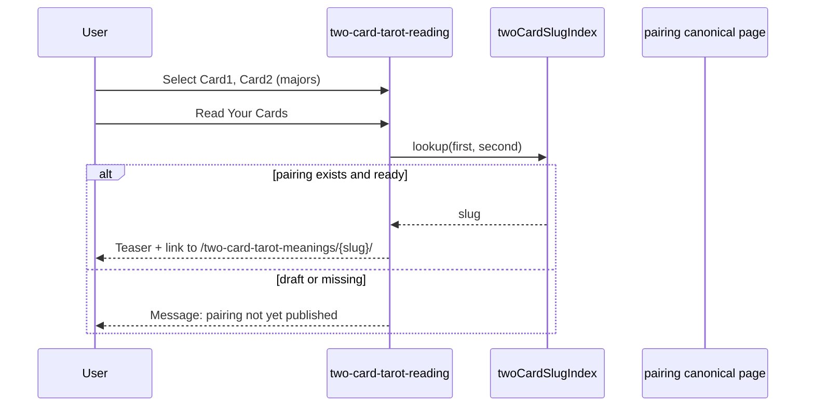

# Two-Card System Architecture Plan

**Status:** Planning / pre-implementation  
**Corpus:** Major Arcana upright ordered pairs (462 entities, no self-pairings)

---

## 1. Recommended architecture (summary)

| Layer | Choice |
|-------|--------|
| Editorial source | `content-intake/two-card-corpus/major-arcana-upright-ordered-pairs-master.md` |
| Production source | **Generated** Astro content collection (`twoCardMeanings`) |
| Pages | Static prerendered pairing routes + hub + existing tool route |
| Tool | Refactored selector → lookup authored slug → deep link |
| SEO | Parallel **tool** vs **meaning** URLs (same as repeating cards) |
| Validation | Script gate before ingest + before `status: ready` |

**Preferred content model:** Hybrid — master markdown stays canonical; ingest emits one normalised markdown file per pairing with frontmatter.

---

## 2. Canonical naming conventions

### 2.1 Display names

Use the 22-name list exactly (see audit doc). Title Case in UI; stored as `firstCardName`, `secondCardName`.

### 2.2 Card slugs (shared with repeating-card majors)

| Card | Slug |
|------|------|
| The Fool | `the-fool` |
| The Magician | `the-magician` |
| The High Priestess | `the-high-priestess` |
| The Empress | `the-empress` |
| The Emperor | `the-emperor` |
| The Hierophant | `the-hierophant` |
| The Lovers | `the-lovers` |
| The Chariot | `the-chariot` |
| Strength | `strength` |
| The Hermit | `the-hermit` |
| Wheel of Fortune | `wheel-of-fortune` |
| Justice | `justice` |
| The Hanged Man | `the-hanged-man` |
| Death | `death` |
| Temperance | `temperance` |
| The Devil | `the-devil` |
| The Tower | `the-tower` |
| The Star | `the-star` |
| The Moon | `the-moon` |
| The Sun | `the-sun` |
| Judgement | `judgement` |
| The World | `the-world` |

### 2.3 Pairing slug

```text
{firstCardSlug}-and-{secondCardSlug}
```

Examples: `the-fool-and-the-tower`, `the-tower-and-the-fool`, `wheel-of-fortune-and-justice`.

**Rules:**

- ASCII lowercase hyphens only
- Always `and` as separator (not `meets`, `with`)
- Order reflects draw order (first slug = Card 1)

### 2.4 Collection ID

```text
{firstCardSlug}/{firstCardSlug}-and-{secondCardSlug}
```

Example: `the-fool/the-fool-and-the-tower` (mirrors `repeating-card-meanings/majors/the-fool` pattern).

### 2.5 Pairing key (internal)

```text
{firstCardName}|{secondCardName}
```

Used in validators and maps.

---

## 3. Content model options

| Option | Pros | Cons | SEO | Maintainability | Risk | Complexity |
|--------|------|------|-----|-----------------|------|------------|
| **1. One MD per pairing in collection** | Native Astro; reviewable diffs; matches repeating cards | 462 files | Excellent per-URL | Good with generation | Low | Medium |
| **2. Single JSON/TS blob** | One artifact | Unreviewable; large bundle | Good if SSR | Poor for editorial diff | Medium | Low |
| **3. YAML/JSON + MD body** | Structured fields + prose | Two-layer mental model | Good | Medium | Medium | Medium |
| **4. Hybrid (recommended)** | Master MD for Leigh; generated MD for site | Two sources of truth unless gated | Excellent | Best long-term | Low if validator strict | Medium |

### Decision: **Option 4 (Hybrid)**

```
content-intake/two-card-corpus/major-arcana-upright-ordered-pairs-master.md  (edit here)
        ↓ ingest-two-card-corpus.mjs
src/content/two-card-meanings/{firstSlug}/{pairingSlug}.md  (generated, marked)
```

**Generated file header:**

```markdown
<!-- GENERATED by scripts/ingest-two-card-corpus.mjs — do not edit -->
```

---

## 4. Route structure

| Route | File (proposed) | Purpose |
|-------|-----------------|---------|
| `/tools/two-card-tarot-reading/` | `src/pages/tools/two-card-tarot-reading.astro` | Interactive tool |
| `/two-card-tarot-meanings/` | `src/pages/two-card-tarot-meanings/index.astro` | SEO hub |
| `/two-card-tarot-meanings/{pairingSlug}/` | `src/pages/two-card-tarot-meanings/[...slug].astro` | Pairing entity |

**New lib modules (mirror repeating cards):**

- `src/lib/twoCardMeanings.ts` — keys, slug index, ready gate
- `src/lib/twoCardUrls.ts` — hub, canonical, tool deep link
- `src/lib/twoCardSeo.ts` — titles, descriptions, breadcrumbs
- `src/lib/twoCardPageModel.ts` — section rendering model
- `src/lib/twoCardEntitySchema.ts` — JSON-LD

**Redirects:** None required at launch (tool URL unchanged). Optional future: `/when-two-cards-meet/` → hub.

---

## 5. Page rendering model

### Pairing page components

1. `Breadcrumbs`
2. Order-matters callout
3. Card images (RWS paths from slug)
4. `featuredSnippetAnswer` + `answerEngineSummary` blocks
5. Body sections (mapped from template)
6. FAQ accordion
7. Related pairings grid
8. Tool CTA

### Section mapping (normalised)

| Source section | Normalised field |
|----------------|------------------|
| Dynamic Recap | `dynamicRecap` |
| Bracketed Directional Context | `directionalContext` |
| The Taste of This Together | `taste` |
| {First} Enters | `firstEnters` |
| {Second} Arrives | `secondArrives` |
| The Dance Unfolds | `dance` |
| If you recognize… first | `resonanceFirst` |
| If you recognize… second | `resonanceSecond` |
| What happens when you sit… | `integration` |
| The Questions | `questions[]` |
| Expanded Reflection (optional) | `expandedReflection` |

Ingest may keep markdown body intact instead of field-splitting in v1; splitting improves FAQ/schema extraction in v2.

---

## 6. Selector tool model



**Deep link format:**

```text
/tools/two-card-tarot-reading/?card1=the-fool&card2=the-tower
```

Tool reads params on load to pre-select dropdowns.

**Majors-only v1:** Filter `tarotCardsNew` or static `MAJOR_22` list in tool script.

---

## 7. Ingestion model

### Pass 1 — Preflight (audit)

- Run `audit-two-card-corpus.mjs`
- Block if `uniquePairings !== 462`

### Pass 2 — Parse

- Classify block format (A/B/C/D/E from audit)
- Extract `firstCard`, `secondCard`
- Strip template preamble

### Pass 3 — Normalise

- Card names → slugs
- Escaped markdown cleanup
- Optional em dash → en dash policy
- Directional “reversal” → approved phrase list

### Pass 4 — Emit

- Write markdown + frontmatter
- Generate `two-card-pairing-index.json` (machine index for tool)

### Pass 5 — Validate

- `validate-two-card-corpus.mjs` on generated output

---

## 8. Validation model (production readiness)

| Check | Level | Rule |
|-------|-------|------|
| Pair count | error | exactly 462 unique keys |
| Duplicates | error | none |
| Self-pairings | error | none |
| Card names | error | must be in MAJOR_22 |
| Slug format | error | `^[a-z0-9]+(-and-[a-z0-9]+)+$` |
| Heading/title presence | error | every file has `firstCard`/`secondCard` in frontmatter |
| Required sections | error (strict) / warn (draft) | template sections present |
| Tarot reversal leakage | error | `\breversed\b` in public fields |
| Directional “reversal” | warn → error | configurable word list |
| Em dash in slug | error | no `—` in slug/url fields |
| Metadata completeness | error for `ready` | title, description, canonical, summary |
| Body length | warn &lt; 1200; error &lt; 800 for `ready` | |
| Inverse pairing exists | warn | both A→B and B→A files |
| Internal links | warn | card slugs resolve in repeating index |
| SEO field length | warn | title &gt; 60 chars, meta &gt; 160 |
| Old fragment references | error in generated | no `interactionArchetype` |

---

## 9. SEO / AEO model

See `TWO-CARD-SEO-AEO-PLAN.md`. Architecture adds:

- `isTwoCardMeaningReady(entry)` — same `status` gate as repeating cards
- Sitemap loop only for `ready` entries
- `getStaticPaths` filters ready pairings

---

## 10. Migration phases

| Phase | Deliverable |
|-------|-------------|
| 0 | Planning docs (this set) |
| 1 | Complete + normalise master MD (462 pairings) |
| 2 | Ingest + validate scripts |
| 3 | `twoCardMeanings` collection + schema |
| 4 | Hub + pairing pages (draft, noindex) |
| 5 | Tool refactor (no reversal, deep links) |
| 6 | Editorial `ready` + sitemap + tools hub live |
| 7 | Deprecate fragment stack for tok2 |

---

## 11. Implementation sequence (Cursor)

1. Add `src/content/config/twoCardMeaningsSchema.ts`
2. Register collection in `src/content.config.ts`
3. Implement `ingest-two-card-corpus.mjs` + `validate-two-card-corpus.mjs`
4. Copy URL/SEO patterns from `repeatingCardUrls.ts` / `repeatingCardSeo.ts`
5. Create `src/pages/two-card-tarot-meanings/[...slug].astro` (prerender)
6. Create hub `index.astro`
7. Refactor tool (remove reversal, add lookup + CTA)
8. Extend `sitemap.xml.ts` when approved
9. Update `src/pages/tools/index.astro` status

**Do not start steps 3–9 until master corpus passes 462/462 audit.**

---

## 12. Open decisions requiring Leigh’s approval

1. **URL cluster name:** `/two-card-tarot-meanings/` (recommended) vs `/when-two-cards-meet/`
2. **Generated files in git:** commit vs CI-only generation
3. **Launch gating:** all 462 ready vs phased by first card
4. **Tool scope:** 22 majors only vs 78 cards with unavailable state
5. **Em dash policy** in published HTML
6. **Replacement copy** for directional “reversal” brackets
7. **Minimum word count** for `ready`
8. **Expanded Reflection** handling (layout + which pairings)
9. **Intro paragraph** placement (tool only vs hub vs both)

---

## 13. Related documents

- `TWO-CARD-CORPUS-AUDIT.md` — source file audit
- `TWO-CARD-SEO-AEO-PLAN.md` — metadata and schema
- `TWO-CARD-MIGRATION-PLAN.md` — legacy file disposition and phases
- `scripts/audit-two-card-corpus.mjs` — repeatable audit

---

## 14. Is the markdown parseable as-is?

**Partially.**

| Aspect | Parseable? |
|--------|------------|
| Fool block (plain template) | Yes with moderate effort |
| Numbered/escaped sections | Yes after unescape pass |
| Untitled blocks | Requires heuristic splitter |
| Markdown H1 late sections | Yes |
| Full corpus completeness | **No — 217 pairings missing by title** |
| Direct deploy without pipeline | **No** |

**Must clean before implementation:** template strip, dedupe, complete missing pairings, title normalisation, escape cleanup, editorial “reversal” wording, explicit pairing titles for every entry.
