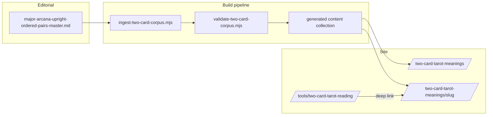

# Two-Card Tool Migration Plan

**From:** Dynamic fragment-combination interpreter (78 cards, upright/reversed, archetype CSV)  
**To:** Canonical authored relational-pair library (22 majors, upright, ordered, 462 pairings)  
**Boundary:** Planning only — no production deploy in this phase.

---

## 1. Migration overview



---

## 2. File disposition matrix

| File | Current role | Recommendation | Notes |
|------|--------------|----------------|-------|
| `src/pages/tools/two-card-tarot-reading.astro` | Live two-card tool UI + fragment engine | **Refactor** | Keep route and UX shell; replace interpretation backend |
| `src/data/tarotCardsNew.js` | 78-card generated data (upright/reversed text, relational profiles) | **Partial retain** | Majors list + images for tool dropdown; remove as fragment source for tok2 |
| `content-intake/tarot/tarot-cards-master.md` | Source for `tarotCardsNew.js` | **Retain** | Still needed for card metadata/build; not pairing corpus |
| `src/data/interactionArchetypes.csv` | Archetype pair metadata | **Deprecate for two-card** | May retain if other tools use — verify |
| `src/data/interactionArchetypes.js` | Generated map for tok2 | **Deprecate for two-card** | Remove import from two-card tool |
| `data/tarot_relational_meanings.csv` | Legacy relational vocabulary | **Deprecate** | Only referenced by merge script |
| `scripts/build-tarotCardsNew.mjs` | Builds tarotCardsNew.js | **Retain** | Shared card infrastructure |
| `scripts/gen-interaction-archetypes.mjs` | Builds interactionArchetypes.js | **Freeze / deprecate** | No new tok2 features |
| `scripts/merge-relational-vocabulary.mjs` | Merges CSV vocabulary into intake | **Deprecate** | One-off legacy |
| `scripts/_tok2-shift-final.mjs` | Tok2-specific transform | **Archive after migration** | Do not delete until refactor verified |
| `scripts/audit-two-card-corpus.mjs` | Corpus audit | **Retain** | Extend into validator |
| `content-intake/two-card-corpus/major-arcana-upright-ordered-pairs-master.md` | Editorial master | **Retain as canonical source** | Not deployed raw |

### Other tools (do not break)

| Consumer | Uses tarotCardsNew? | Action |
|----------|---------------------|--------|
| `three-card-relationship-tarot-reading.astro` | Unknown / separate | Audit before any tarotCardsNew slimming |
| `tarot-combination-interpreter.astro` | `tarotCards.js` (78 cards) | **Unaffected** |
| Repeating card tool | `repeatingCardMeanings` collection | **Unaffected** |

**Rule:** Do not delete shared files until grep confirms zero consumers.

---

## 3. Logic to remove from two-card tool

| Feature | Remove? |
|---------|---------|
| Reversed orientation radio buttons | **Yes** |
| `readOrientReversed()` / `face(card, isReversed)` | **Yes** |
| `interactionArchetypeMap` lookup | **Yes** |
| Fragment stitching / effect compression / relational clause assembly | **Yes** |
| Debug typography mode (`debugReading=1`) | **Yes** (after launch) |
| Random draw across 78 cards | **Change** → majors only (22) or majors default |
| Full reading HTML in tool output | **Replace** → teaser + link to canonical |

---

## 4. UX to retain

| Element | Retain |
|---------|--------|
| Two dropdowns, Card 1 / Card 2 | Yes |
| Draw Cards / Read Your Cards / Clear | Yes |
| Collapsed selection summary + Change cards | Yes |
| Panel layout, `tarot-tool` CSS classes | Yes |
| Cross-links to three-card tool and repeating-card tool | Yes (update copy) |
| “When Two Cards Meet” framing | Yes |
| Card images in tool result | Yes (link to canonical for full reading) |
| `aria-live` output region | Yes |

---

## 5. Proposed scripts

### 5.1 `scripts/ingest-two-card-corpus.mjs` (new)

**Input:** `content-intake/two-card-corpus/major-arcana-upright-ordered-pairs-master.md`  
**Output:** `src/content/two-card-meanings/generated/{slug}.md` (or JSON — see architecture plan)

**Steps:**

1. Strip template preamble (lines before first pairing).
2. Split on pairing boundaries (title line OR validated untitled block).
3. Normalise card names → canonical IDs.
4. Build slug `{first}-and-{second}`.
5. Map sections to frontmatter + markdown body.
6. Replace directional “reversal” phrases (configurable).
7. Normalise escapes (`\---` → `---`).
8. Write `GENERATED — do not edit` header.

### 5.2 `scripts/validate-two-card-corpus.mjs` (new)

**Fails CI if:**

- Unique pairing count ≠ 462
- Any duplicate `first|second` key
- Any self-pairing
- Unknown card name
- Missing required sections (configurable strictness)
- Empty slug / invalid characters
- “reversal” leakage (tarot sense) in generated files
- Optional: em dash in slug fields

**Warns if:**

- Body word count &lt; 1,200
- Missing FAQ extract
- Missing inverse pairing file in generated set

### 5.3 `scripts/audit-two-card-corpus.mjs` (existing)

Keep for editorial reports; delegate gate checks to validator.

---

## 6. Build / test steps (future)

```bash
# Editorial (manual) — complete master MD, then:
node scripts/audit-two-card-corpus.mjs

# When corpus complete:
node scripts/ingest-two-card-corpus.mjs
node scripts/validate-two-card-corpus.mjs

# Site
npm run build
# Spot-check: tool deep link, pairing page, hub, sitemap entries
```

**Astro:** Add `twoCardMeanings` collection to `src/content.config.ts` when implementing.

---

## 7. Phased implementation

### Phase 0 — Planning (current)

- Audit + architecture docs ✅
- No route or tool changes

### Phase 1 — Corpus complete

- Editorial: 462 pairings, dedupe, normalise titles
- Validator green on master

### Phase 2 — Ingestion pipeline

- Content collection + generated files
- `status: draft` default; no sitemap

### Phase 3 — Canonical pages

- Hub + `[...slug]` pairing route
- SEO lib (mirror `repeatingCardUrls.ts` pattern)
- Schema/JSON-LD

### Phase 4 — Tool refactor

- Majors-only selection (or full 78 with “meaning available” guard)
- Remove reversal UI
- Deep link to canonical pairing
- Tools hub: change “COMING SOON” → live

### Phase 5 — Deprecation cleanup

- Remove tok2 fragment imports
- Archive legacy CSV/JS if unused
- Redirect audit if any old URLs existed

### Phase 6 — Enhancement

- Repeating-card cross-links
- First-card sub-hubs
- Analytics on tool → canonical CTR

---

## 8. Risk assessment

| Risk | Likelihood | Impact | Mitigation |
|------|------------|--------|------------|
| Incomplete corpus shipped | High if rushed | High | Validator blocks build |
| Duplicate content (tool + page) | Medium | SEO | Teaser-only tool |
| Breaking three-card tool | Low | Medium | Grep before deleting shared data |
| 462-page crawl budget | Low–Medium | Medium | `ready` gate; quality thresholds |
| Authoring drift in master MD | Medium | Medium | Generated files only from ingest |
| Inverse pair keyword overlap | Medium | Low | Distinct titles + cross-links |

---

## 9. Rollback strategy

- Tool refactor behind feature flag or branch until pairing pages exist.
- Keep `interactionArchetypes.js` in repo until Phase 5.
- Generated content directory can be `.gitignore`’d or committed — decide in architecture (recommend **commit generated** for reproducible builds).

---

## 10. Open decisions for Leigh

1. Tool card picker: **majors only** vs 78 with “no authored pairing” message for minors/cross-suit.
2. Commit generated pairing files to git or generate in CI only.
3. Launch threshold: all 462 `ready` vs staggered by first card.
4. Retire “COMING SOON” on tools hub when Phase 4 completes.
